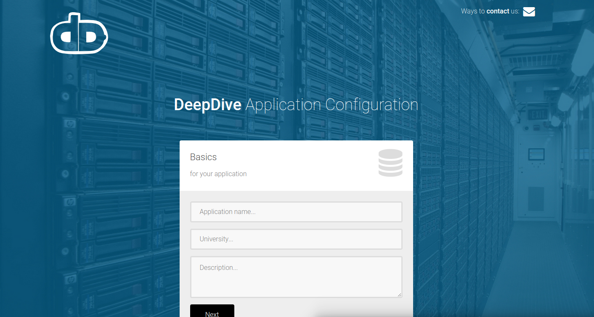
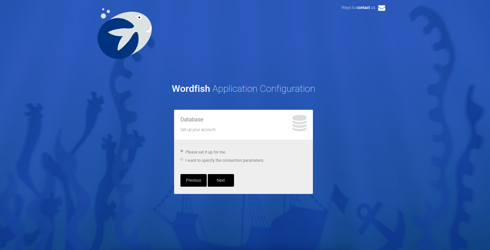
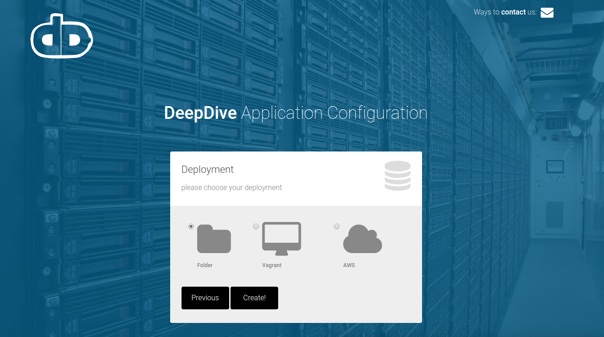

# deepdive-python

** under development **

Standardizing inputs, outputs, and processing steps of "deepdive-like" platform for a cloud deployment/tool. Choose your input corpus, terminologies, and deployment environment, and an application will be generated to run your analysis. Custom plugins will allow for dynamic generation of corpus and terminologies from data structures and standards of choice from [deepdive-plugins](http://www.github.com/vsoch/deepdive-plugins) You can have experience with coding (and use the functions in the module as you wish), or no experience at all, and let the interactive web interface walk you through generation of your application. This will ideally be able to generate single instances of analysis applications, and an instance that we can deploy on the cloud (and integrate into a collaborative, cloud-based tool for many researchers to use).

[will eventually be here](https://pypi.python.org/pypi/deepdive)

** under development! ** not ready for use!

### 0. Install the tool

      pip install git+git://github.com/vsoch/deepdive-python.git

### 1. Generate your application

Call the tool to configure your application:

    ddpython

Setup your database, or have the tool set it up for you.

Select your deployment preference.

This will produce a folder for you to drop in your cluster environment.

### 2. Install dependencies

Drop the folder into your home directory of your cluster environment. Run the install script to install deepdive, corenlp, and the package itself. The first (and only) argument is the project directory where you want your data and outputs to live.

      
      WORK=/scratch/users/vsochat/deepdive-nlp
      bash install.sh $WORK
      

### 3. Prepare cluster jobs

After installations are complete, this install script will also call `run.py`, which will do preliminary work preparing all input files and corpus to do extractions. This is just preparing job files and is not hugely computationally intensive, and could probably be done on a screen on a home node. If you feel antsy about it, you can connect to a dev node. If you look at the run.py script, you will see commands appended to prepare the corpus and terms that you specified. This is going to generate the following file structure in your project folder (and files that will eventually be produced are shown):

      WORK
          SOFTWARE
              deepdive
              stanford-corenlp...
          APP
              corpus
                  corpus1
                      12345_sentences.txt
                      12346_sentences.txt
                  corpus2
                      12345_sentences.txt
                      12346_sentences.txt
              extractions
                      corpus1_12345_extractions.txt
                      corpus1_12346_extractions.txt
                      corpus2_12345_extractions.txt
                      corpus2_12346_extractions.txt
              terms
                  terms1
                  terms2

              jobs
                  run1_corenlp.txt
                  run2_mentions.txt
                  run3_relations.txt
                  run4_features.txt
                  run5_inference.txt
              scripts
                  run_stanford_parser.py 

The folders are generated dynamically for each corpus and terms plugin based on the "tag" variable in the plugin's config. The tag names for the plugins are the only unique requirement, and the creator of the plugin can either decide a meaningful unique id for the sentences output, or not specify and let deepdive.corpus decide. This doesn't matter until all extractions are complete, at which time a unique ID is assigned to the files.

Note: I am not entirely sure that this pipeline will use DeepDive, or the stanford parser, period. I think there might be more efficient ways to do similar analysis.

### 4. Run cluster jobs

Most of these files are not generated with the run.py script - the run.py script generates jobs to be run in parallel to produce these files (in the "jobs" directory), and some of these jobs require generic scripts (in the "scripts" directory) that use deepdive-python functions in the cluster environment. The high level idea is that we package each step of the pipeline into a set of jobs that can be run in parallel (specified as lines in each file in the "jobs" directory). This means that after running run.py, you will have sentenves for each corpus, a term data structure for each data structure, and a folder filled with "jobs" to submit to a cluster, and run in the order specified when the previous step has completed. This package provides functions for running these commands in a slurm (submission) environment, or a launch system (all at once) (details to follow).

(Note: For now, since obtaining the corpus and parsing to sentences is not computationally or time intensive, this is also done by the run script, but this could also be moved to be a cluster task.)

** under development **
more details to come as they are figured out, coded, etc.

## Overview of Project
I first tried setting up DeepDive in a standard way, to perform extractions of mentions and features by way of the deepdive executable, to the database. The project was ultimately successful in that I completed all steps through inference, but it was too hard. I then had two choices - to be a user and try to refine my particular classifier, or try to improve the process (now that I understand it). I did not feel that I had the amount of control that would be desired, as the current infrastructure does not extend well to a SLURM environment with a launch setup. I realized very quickly that I was using the DeepDive command simply as a wrapper to write to the data base, and given that I had to write my own scripts anyway, it would be easiest to break apart the initial steps for extractions, build more "container-ized" methods to do initial steps, and then use DeepDive for the training and inference (where I see it's strength). It was also apparent that with the current setup, users would be doing different versions of the same thing, over again, and this is not efficient. I want to start from scratch with a modified infrastructure, and this gives me an opportunity to think about how I want to do this, because it needs to be a lot easier than it currently is. My first goal is to standardize the process, and build a set of python tools that can work with simple inputs and outputs for (what will eventually be) a cloud-based or VM-based deployment. I am going to think about this in the context of Neuroimaging / Psychology analysis, and that all steps should come from data structures (and not manually doing things).

### Infrastructure
The big picture idea is that a user will be walked through the process of setting up a deepdive deployment. He she will install this python module, open up a web interface, and choose one or more terminologies to determine "mentions," choose one or more sources of input data (corpus), and then the ultimate deployment environment. After this process, a custom instantiation of the module will be generated to install in the environment of choice. In the case that the user selects a virtual machine, the setup of databases / envionment will be done automatically on this VM (either local vagrant or cloud-aws). In the case of deployment on a cluster, a zipped up folder with the instantiation will be produced to be dropped onto the cluster, installed, and run. More details will follow.

#### Corpus and Terminology Plugins
I should be able to retrieve (programatically) from a selection of corpus and terminology. There should be a "plugins" folder with different wrappers for various corpus and terminology sources. The outputs of these plugins should be validated before giving the user access to choose them. Please see the [deepdive-plugins](http://www.github.com/vsoch/deepdive-plugins) README for details. 

#### Thinking about Workflow
Running this module as an application, it should produce something that can be immediately deployed to do the analysis. However for advanced users, it should be just as easy to use the python module functions, as is, in custom scripts. This seems like a reasonable solution, for now, until there is a way to make a central cloud-based tool that can send computationally intensive jobs to a controller on a cluster, likely with some kind of authenticated REST call. The user should also have the option to use deepdive as it is originall done, running things in serial locally. 

Since I am just developing these functions, to start I think that I will develop the "application instance" approach that configures a pipeline to run on a SLURM cluster after specifying a set of resources. Then I can expand on that.

#### Deployment Options

##### Virtual Machine
The user can select to deploy to a vagrant-vm, or amazon-aws virtual machine. This means (for now) that all processing will be done in serial (or with a small job manager). This means that deepdive and an appropriate database can be configured and set up for the user, or he/she can specify a different database.

##### Cluster
The user can select to deploy an analysis application, meaning a zipped up folder with an install script to deploy in a cluster environment. I will start with two options for job managers: SLURM, and "launch" (meaning using a grid system set up with a SLURM cluster). For launch, commands will be executed as lines in a single file. For SLURM, commands will be sbatch commands submit from a particular user when jobs are allowed.

#### Local
If the user already has deepdive, the same zipped up folder can be deployed locally (sans cluster submission), but I don't see why anyone would want to do this.

### Standards
Standards will be different kinds of file structures that the module will know how to parse. Including:

- owl: a structured language (ontology) is an extension of an RDF file, and an obvious candidate to define different mentions.
- nifti: is a brainmap image, for an atlas or brain map (also structured, an XML file and nifti image)

### Plugins 
Plugins will be resources from which to derive corpus and/or terminology (terms). Initial plugins will include the following:

- wordnet: people might just want a subset of "normal word" terms deemed important by way of relationships in wordnet
- reddit: in my mind, is a rich source of behavioral phenotypes
- pubmed: many plugins will require downloading abstracts or full text from here
- cognitiveatlas: an ontology of cognitive concepts, tasks, disorders
- neurosynth: database of significant coordinates extracted from a set of pubmed abstracts, and associated features (terms)
- neurovault: database of statistical brain maps (corpus)

### First Project
I will start with nifti, meaning using labels from at atlas or brain map, and finding relationships to cognitive concepts (cognitiveatlas) as this seems like the quickest way to connect terms with actual data. I will develop the module to interactively collect my desired inputs, and then deploy the application to the TACC cluster (SLURM launch system).
