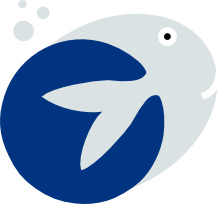
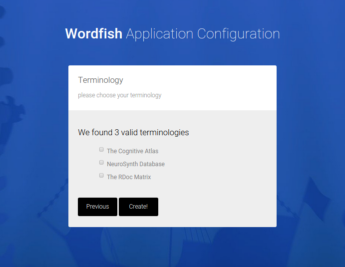
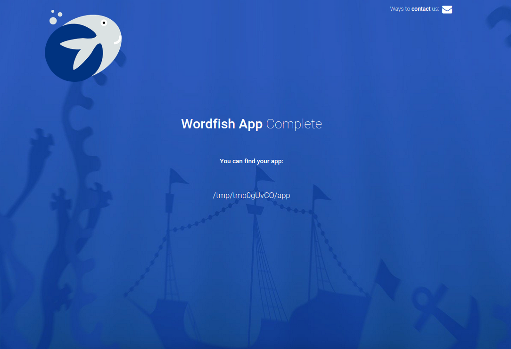

# wordfish-python

  >>   If pulling a thread of meaning from woven text  
  >>   is that which your heart does wish.  
  >>   Not so absurd or seemingly complex,   
  >>   if you befriend a tiny word fish.  

    

Choose your input corpus, terminologies, and deployment environment, and an application will be generated to use deep learning to extract features for text, and then entities can be mapped onto those features to discover relationships  and classify new texty things. Custom plugins will allow for dynamic generation of corpus and terminologies from data structures and standards of choice from [wordfish-plugins](http://www.github.com/word-fish/wordfish-plugins) You can have experience with coding (and use the functions in the module as you wish), or no experience at all, and let the interactive web interface walk you through generation of your application. This will ideally be able to generate single instances of analysis applications, and an instance that we can deploy on the cloud (and integrate into a collaborative, cloud-based tool for many researchers to use).

[will eventually be here](https://pypi.python.org/pypi/wordfish)

** under development! ** not ready for use!

### 0. Install the tool

      pip install git+git://github.com/word-fish/wordfish-python.git

### 1. Generate your application

Call the tool to configure your application:

    wordfish

Select your terminologies and corpus.

A custom application is generated for you!

This will produce a folder for you to drop in your cluster environment.

### 2. Install

Drop the folder into your home directory of your cluster environment. Run the install script to install the package itself, and generate the output folder structure. The only argument that you need to supply is the base of your output directory:

      WORK=/scratch/users/vsochat/wordfish
      bash install.sh $WORK

All scripts for you to run are in the scripts folder here:

      cd $WORK/scripts

Each of these files corresponds to a step in the pipeline, and is simply a list of commands to be run in parallel. You can use launch, or submit each command to a SLURM cluster. There will eventually be scripts provided for easily running with your preferred method.

#### Project Current Status
[Plugins](https://github.com/word-fish/wordfish-plugins) are being developed, and pipelines tested. When this is finished, the functionality will be integrated into the application generation. It is not yet decided if a database will be used for the initial processing. For deployment options, it makes sense to deploy the module folder to a cluster environment, and then perhaps deploy an application with docker. I have not yet decided. I have also not yet implemented the inference, but I have a good idea of how I'm going to do it.

           
### 3. Running the Pipeline

After the installation of your custom application is complete, this install script simply runs `run.py`, which generates all output folders and running scripts. It used to be the case that this script did some preprocessing, but I have moved all these steps to be specified in the files in the `scripts` folder. This means that you have a few options for running:

- sumbit the commands in serial, locally. You can run a job file with bash, `bash run_extraction_relationships.job`
- submit the commands to a launch cluster, something like `launch -s run_extraction_relationships.job`
- submit the commands individually to a slurm cluster. This will mean reading in the file, and submitting each script with a line like `sbatch -p normal -j myjob.job [command line here]`

      
### 4. Infrastructure
The jobs are going to generate output to fill in the following file structure in your project base folder (and files that will eventually be produced are shown):

      WORK
              corpus
                  corpus1
                      12345_sentences.txt
                      12346_sentences.txt
                  corpus2
                      12345_sentences.txt
                      12346_sentences.txt
              terms
                  terms1_terms.txt
                  terms2_relationships.txt

              scripts
                  run_extraction_corpus.job
                  run_extraction_relationships.job
                  run_extraction_terms.job

The folders are generated dynamically by the `run.py` script for each corpus and terms plugin based on the "tag" variable in the plugin's config. Relationships, by way of being associated with terms, are stored in the equivalent folder, and the process is only separate because it is not the case that all plugins for terms can have relationships defined. The corpus are kept separate at this step as the output has not been parsed into the wordfish standard to allow integration across corpus and terminologies, at which point wordfish unique IDs will be assigned. 

#### Deployment Options

Right now the only option (that works) is to generate a folder and install on a cluster, however if there is interest or need, I can generate a version to install and run on a virtual machine, either with vagrant (local) or vagrant with amazon web services, and I am also thinking about docker for easy cloud deployment.

### Plugins 
Plugins will be resources from which to derive corpus and/or terminology (terms). Optionally, a terminology can also have relationships. To see an initial list of available plugins, see the [wordfish-plugins](http://www.github.com/word-fish/wordfish-plugins) repo.

### Data
We will eventually want to relate these analyses to data, such as brain imaging data. For example, NeuroVault is a database of whole-brain statistical maps with annotations for terms from the cognitive atlas, so this means we can link brain imaging data to terms from the cognitive atlas ontology, and either of the fsl or fma_nif plugins, which both define brain regions. Toward this aim a separate [wordfish-data](http://www.github.com/word-fish/wordfish-data) repo has been added. Nothing has been developed here yet, but it's in the queue.
